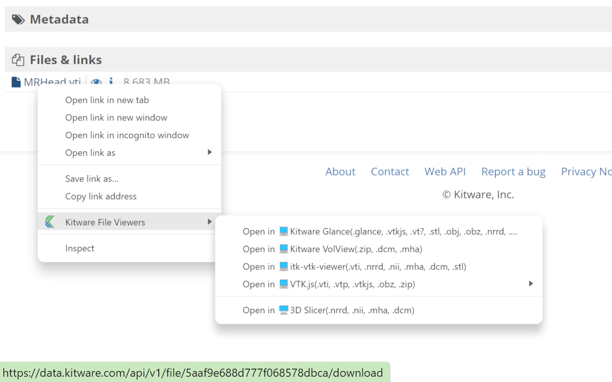

# OpenInBrowserExtension

Cross-browser extension that lets you conveniently open URLs with Kitware online viewers.


*Example of usage with [Girder](https://girder.readthedocs.io/en/latest/) (e.g. https://data.kitware.com)*


## Browser support

It is known to work with at least the following desktop browsers:
 - Firefox 108.0.2
 - Chrome 108.0.5359.126
 - Edge 109.0.1518.55

It should work (not tested) with:
 - all chromium-based browsers such as Opera
 - Safari

## Viewer support

The following viewers are supported:
 - [Kitware Glance](https://kitware.github.io/glance/)
 - [VTK.js viewer examples](https://kitware.github.io/vtk-js/examples/)
 - [itk-vtk-viewer](https://kitware.github.io/itk-vtk-viewer/docs/)

## File support

Most viewers need to be opened with the file extension as parameter.
First the extension attempts to extract the file extension from the URL.
Because some URLs may not contain the file extension, as an optional second step, the extension downloads a few bytes of the file and attempts to detect the file extension by reading the file headers.
This is not perfect and does not work well with ZIP archives because no unzipping is performed (yet).
Here is the explicit list of files supported by the extension :
 - vtp (vtkPolyData)
 - vti (vtkImageData)
 - vtu (vtkUnstructedGrid)
 - nrrd

## Install

Until the extension is published, you have to manually install it.

### Chrome
Follow the [Loading unpacked extension tutorial](https://developer.chrome.com/docs/extensions/mv3/getstarted/development-basics/#load-unpacked).

### Firefox

Follow the [Temporary installation tutorial](https://extensionworkshop.com/documentation/develop/temporary-installation-in-firefox/).

### Edge

Follow the [Sideload an extension tutorial](https://learn.microsoft.com/en-us/microsoft-edge/extensions-chromium/getting-started/extension-sideloading).

## Usage

Right click on a link in any webpage to open the context menu.

You can also select the text of an url and right click to open the context menu.

### Local files

You can also visualize local files. You just have to serve your files. Here are some one-liners to help you do so:

#### Python

```
python.exe -m http.server 8000
```

#### Node.js

```
npm install -g http-server
http-server -p 8000 --cors
```

Then you can open on your browser localhost:8000 to see your files.
